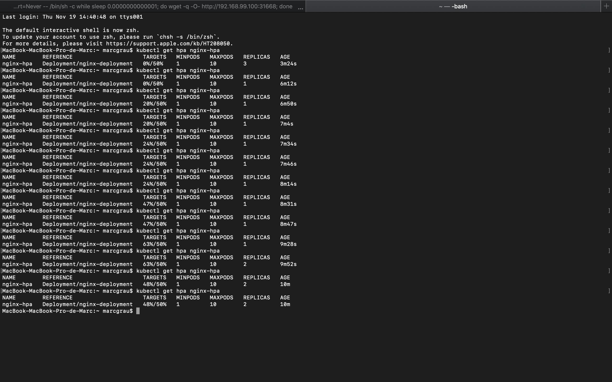

EXERCISE 3
==========

Deployment:
```
apiVersion: apps/v1
kind: Deployment
metadata:
  name: nginx-deployment
  labels:
    app: nginx-deployment
spec:
  replicas: 3
  strategy: 
    type: Recreate
  selector:
    matchLabels:
      app: nginx-deployment
  template:
    metadata:
      labels:
        app: nginx-deployment
        version: v1.0.0
    spec:
      containers:
      - name: nginx
        image: nginx:1.19.4
        resources:
          limits:
              memory: "256Mi"
              cpu: 100m
          requests:
              memory: "256Mi"
              cpu: 100m
        ports:
        - containerPort: 80
```

Service:
```
apiVersion: v1
kind: Service
metadata:
  name: nginx-service
spec:
  type: NodePort
  selector:
    app: nginx-deployment
  ports:
    - port: 80
      targetPort: 80
```

HorizontalPodAutoscaler:
```
apiVersion: autoscaling/v2beta2
kind: HorizontalPodAutoscaler
metadata:
  name: nginx-hpa
spec:
  scaleTargetRef:
    apiVersion: apps/v1
    kind: Deployment
    name: nginx-deployment
  minReplicas: 1
  maxReplicas: 10
  metrics:
  - type: Resource
    resource:
      name: cpu
      target:
        type: Utilization
        averageUtilization: 50
```

Se necesita habilitar metrics-server para que el HorizontalPodAutoscaler pueda ver el uso de la CPU:
```
minikube addons enable metrics-server
```

Invocar peticiones para ver la carga del HorizontalPodAutoscaler:
```
kubectl run -i --tty load-generator --rm --image=busybox --restart=Never -- /bin/sh -c "while sleep 0.0000000001; do wget -q -O- http://192.168.99.100:31668; done"
```

Consultar la carga del HorizontalPodAutoscaler:
```
kubectl get hpa nginx-hpa
```

Estado del HorizontalPodAutoscaler al ir aumentando el número de peticiones:
